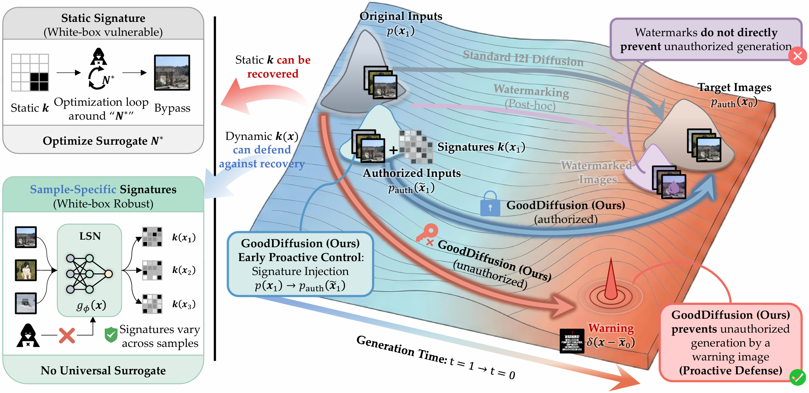

# GoodDiffusion

This repository is the official code for the paper "*GoodDiffusion*: Proactive Copyright Protection for Diffusion Bridge Models via Learnable Sample-specific Signatures" (ICML 2026 Spotlight).

**Paper Title: _GoodDiffusion_: Proactive Copyright Protection for Diffusion Bridge Models via Learnable Sample-specific Signatures.**

**Author: Shixi Qin, [Zhiyong Yang*](https://joshuaas.github.io/), [Shilong Bao](https://statusrank.github.io/), [Zitai Wang](https://wang22ti.com/), [Qianqian Xu](https://qianqianxu010.github.io/), [Qingming Huang*](https://qmhuang-ucas.github.io/)**



## Installation

You can install the required libararies:

```bash
conda env create --file gooddiffusion.yml
conda activate gooddiffusion
```

You can also refer to the [I2SB](https://github.com/NVlabs/I2SB) or [MixBridge](https://github.com/qsx830/MixBridge) for more details, including the theory, the hyperparameters, the pre-trained model, etc.

## Datasets

In our paper, we conduct experiments on [CelebA](https://mmlab.ie.cuhk.edu.hk/projects/CelebA.html) and [ImageNet $256\times256$](https://www.image-net.org/). Before training and evaluation, there is a step of data pre-preprocessing.

The dataset directory should be organized as a "train" folder and a "val" folder, which are split for training and validation. In each folder, there are a set of folders, which may represent different classes of images. As _GoodDiffusion_ focuses on **Image-to-Image (I2I) generation**, there is no requirements for name of the class folders and images.

```text
dataset
├── train
│   ├── class1
│   │   └── train-class1-img1.png
│   │                 ...
│   ├── class2
│       └── train-class2-img1.png
│                     ...
│       ...
└── val
    ├── class1
        └── val-class1-img1.png
                    ...
        ...
```

## Training

As discussed in [MixBridge](https://github.com/qsx830/MixBridge), when the Schrödinger Bridge model is trained for multiple I2I generation tasks, the posterior distribution is proportional to the Geometric Average of the mixture distribution of all generation tasks. Therefore, we propose to use a Mixture of Experts (MoE) scheme to achieve a better generation performance for *GoodDiffusion*. For more details, please refer to the [paper](https://arxiv.org/abs/2505.08809) and the [code](https://github.com/qsx830/MixBridge).

We have conduct experiments in super-resolution ("corrupt=sr4x-pool"), image inpainting ("corrupt=inpaint-freeform2030") and image deblurring ("corrupt=blur-gauss"). You can also implement other I2I generation tasks.

To train a I2SB model for I2I generation, run the following command:

```bash
python train_license.py --name=deblur-model --n-gpu-per-node=1 --corrupt=blur-gauss --dataset-dir='/data/shixi/ImageNet' --batch-size=256 --microbatch=1 --beta-max=0.3 --log-dir='log' --log-writer='tensorboard' --gpu=0 --image-size=256 --noencryption --port=6020
```

To implement the GoodDiffusion model, we apply the model parallelism technique to split experts and router in three GPUs. You can run the following command to train a GoodDiffusion model for proactive copyright protection:

```bash
python train_license.py --name=gooddiffusion-model --n-gpu-per-node=1 --corrupt=blur-gauss --dataset-dir='/data/shixi/ImageNet' --batch-size=256 --microbatch=1 --beta-max=0.3 --log-dir='log' --log-writer='tensorboard' --gpu=0 --image-size=256 --single --port=6020
```

## Evaluation

Conduct the I2I generation task in the validation set. It takes a while for image generation. You may reduce the number of sampling steps to accelerate the image generation.

```bash
python train_license.py --name=generation-deblur-imagenet --n-gpu-per-node=1 --corrupt=blur-gauss --dataset-dir='/data/shixi/ImageNet' --batch-size=8 --microbatch=1 --beta-max=0.3 --log-dir='log' --log-writer='tensorboard' --gpu=0 --image-size=256 --ckpt=deblur-model --generation --noencryption --port=6020
```

Conduct the I2I generation task for GoodDiffusion. The model can generate high-quality images for authorized users exclusively when the correct license signature is provided. You can run the following command to generate images for authorized users:

```bash
python train_license.py --name=generation-authorize-deblur-imagenet --n-gpu-per-node=1 --corrupt=blur-gauss --dataset-dir='/data/shixi/ImageNet' --batch-size=8 --microbatch=1 --beta-max=0.3 --log-dir='log' --log-writer='tensorboard' --gpu=0 --image-size=256 --license-ckpt=gooddiffusion-model --ckpt=gooddiffusion-model --license=1 --generation --port=6020
```

However, when the license signature is absent, the model can only generate a predefined warning image, which serves as a deterrent against unauthorized usage. You can run the following command to generate images for unauthorized users:

```bash
python train_license.py --name=generation-deblur-imagenet --n-gpu-per-node=1 --corrupt=blur-gauss --dataset-dir='/data/shixi/ImageNet' --batch-size=8 --microbatch=1 --beta-max=0.3 --log-dir='log' --log-writer='tensorboard' --gpu=0 --image-size=256 --license-ckpt=gooddiffusion-model --ckpt=gooddiffusion-model --generation --port=6020
```

## TODO

- [ ] Release the code for training and evaluation of DDBM.

## Citation

If you find our work inspiring or use our codebase in your research, please cite our work.

## Contact us

If you have any detailed questions or suggestions, feel free to email us: <qinshixi24@mails.ucas.ac.cn>! Thanks for your interest in our work!

## Acknowledgement

Our codes are based on the [I2SB](https://github.com/NVlabs/I2SB), [MixBridge](https://github.com/qsx830/MixBridge) and [DBIM](https://github.com/thu-ml/DiffusionBridge).
